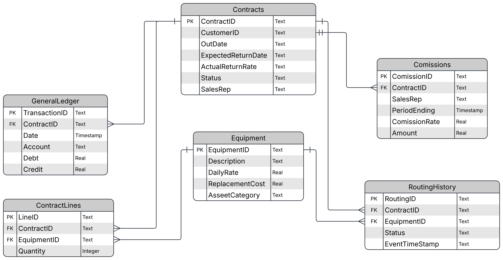
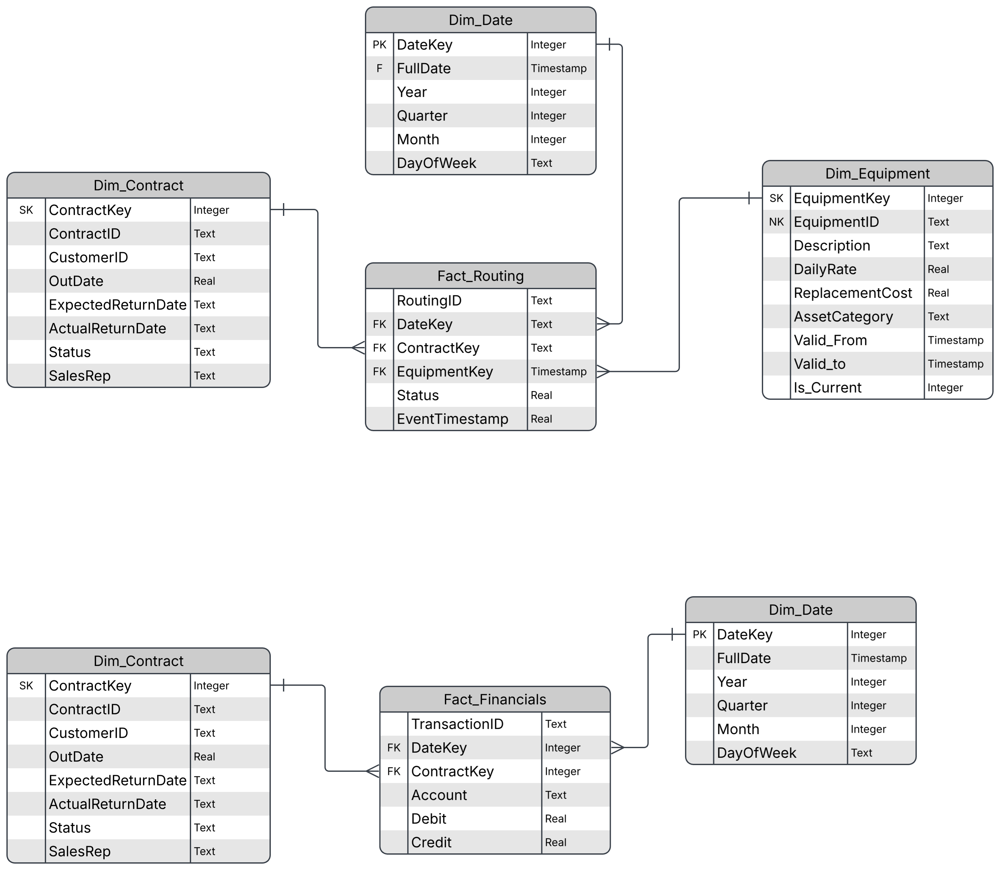

# Salas Rentals Analytics

An end-to-end synthetic data pipeline simulating a highly normalized OLTP backend for a heavy equipment rental company. This project generates realistic, multi-table transactional data, injects intentional operational anomalies, and processes complex financial logic (tiered commissions and amortized revenue recognition).

It is designed to serve as a foundational environment for Analytics Engineering tasks: data cleansing, multi-source reconciliation, dimensional modeling (Star Schema), and Power BI visualization.

## Tech Stack
* **Python** (Core pipeline logic)
* **Pandas** (Data manipulation, financial math, and anomaly injection)
* **SDV (Synthetic Data Vault)** (Machine-learning-based relational data generation)
* **uv** (Dependency and environment management)
* **SQLite** (Local zero-configuration database output)
* **Power BI** (Target presentation and visualization layer)

## Database Architecture (OLTP)
The database (`salas_rental_system.db`) mimics a live equipment rental software backend across three distinct layers:

1. **The Transactional Core (Source):** Highly normalized `Equipment` master data tied to `Contracts` and `ContractLines`.
2. **Operational Tracking (Bronze Layer):** The `RoutingHistory` table tracks asset movement but contains intentional "dirty" data (duplicate pings, time-travel errors, orphaned IDs) to simulate raw system logs.
3. **Financial Processing (Gold Layer):** The `GeneralLedger` (monthly amortized revenue) and `Commissions` (tiered percentage payouts) tables apply complex business logic to the raw rental timelines.

### Entity Relationship Diagram

## Data Warehouse (OLAP)

### Entity Relationship Diagram

